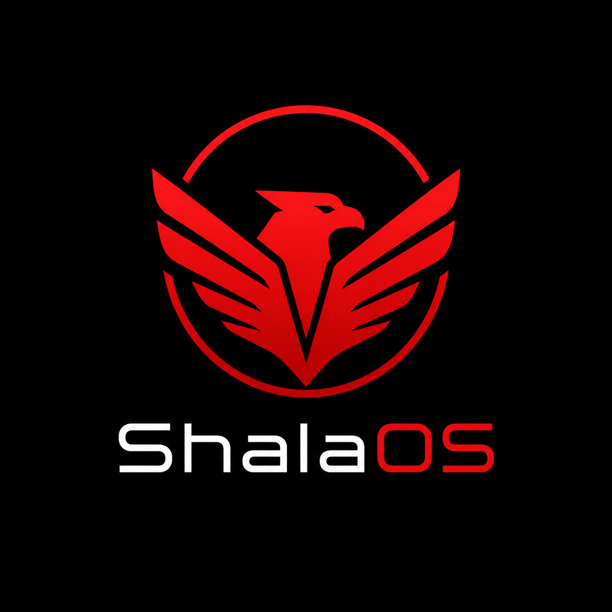

<div align="center">



# ShalaOS

**A custom Linux distribution: Arch-based, KDE Plasma desktop, dark-and-red _"dardania"_ theme.**

[](LICENSE)
[](https://github.com/edizsale/shalaos/releases)
[](https://github.com/edizsale/shalaos/actions/workflows/build-iso.yml)

[Download](https://github.com/edizsale/shalaos/releases) ·
[Install (TR)](docs/kurulum.md) ·
[Build](docs/BUILD.md) ·
[Contributing](CONTRIBUTING.md) ·
[Türkçe](README.md)

</div>

---

## What is it?

ShalaOS is an Arch Linux distribution with a fully themed identity, built around the idea of
"ShalaOS everywhere". It ships the **dardania** Plasma Global Theme — a dark base with red
accent (AccentColor 228,20,30) and a red eagle logo. KDE Plasma was chosen over GNOME for its
theming freedom. It is the continuation of **Abinti**, an earlier Debian/XFCE alpha.

The primary language of the distribution and its documentation is **Turkish**.

## Features

- 🦅 **End-to-end ShalaOS branding** — logo, wallpaper, SDDM, Plymouth boot splash, panel
  launcher, welcome page.
- 🎨 **dardania theme** — Breeze Dark–based dark/red Global Theme, color scheme and window
  decoration.
- 🇹🇷 **Turkish localization** — language, keyboard and timezone (Istanbul) preconfigured.
- 💿 **Live + install** — installable to disk via Calamares; no internet required.
- 🖥️ **KDE Plasma** — Dolphin, Konsole, Kate, Spectacle, Chromium and more.
- 🔁 **Arch rolling** — stays current with `pacman -Syu` after install.
- 🔐 **Signed, verifiable ISOs** — SHA-256 + GPG signature.

## Download

**Grab the latest ISO from [Releases](https://github.com/edizsale/shalaos/releases), write it
to a USB stick, and boot. That's it.**

<details>
<summary><b>Verifying your download (optional)</b></summary>

Not required — but if you want to be sure the download isn't corrupted, grab the `.sha256`
file next to the ISO and run one command:

```bash
sha256sum -c ShalaOS-*-Dardania-x86_64.iso.sha256   # expect "OK"
```

**Advanced (GPG signature):** to cryptographically confirm the ISO was published by ShalaOS,
use the `.sig` file:

```bash
gpg --import KEYS
gpg --verify ShalaOS-*-Dardania-x86_64.iso.sig ShalaOS-*-Dardania-x86_64.iso
```

</details>

## System requirements

ShalaOS is lightweight — **it runs comfortably on older, low-spec machines too.** KDE Plasma is
smooth on modest hardware, and installation needs no internet.

| Component | Minimum | Recommended |
|-----------|---------|-------------|
| CPU | 64-bit (x86_64), dual-core | 2+ cores, ~2 GHz |
| RAM | **2 GB** | 4 GB |
| Disk | **20 GB** free | 30 GB+ (SSD) |
| Graphics | OpenGL-capable (integrated GPU is fine) | — |
| Firmware | UEFI **or** legacy BIOS | UEFI |

> Note: ~2 GB RAM is enough to try the live session. The installer (Calamares) rejects disks
> under 15 GB, so the target disk should be at least 20 GB.

## Build

Two ways — automated CI (on tag push) and manual VM build. See **[docs/BUILD.md](docs/BUILD.md)**.

```bash
./build.sh   # needs Docker; ISO lands in out/
```

## License & trademark

Source code is under **[GPL-3.0](LICENSE)**. The **"ShalaOS" name, red eagle logo and visual
identity** are protected — see [TRADEMARK.md](TRADEMARK.md). Third-party attributions:
[NOTICE.md](NOTICE.md).
